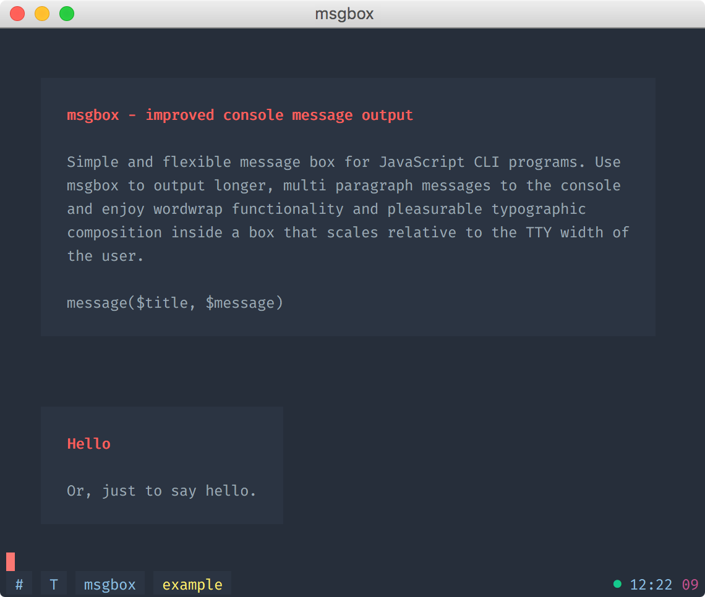

# msgbox

> Improved console message output



## Install

```
$ npm install --save msgbox
```

## Usage

```js
const msg = require('msgbox');

// Send message to console
msg('The title', 'And here goes your message.');
```

## Related

* [msgbox-cli](https://github.com/bramkok/msgbox-cli) CLI for this module
